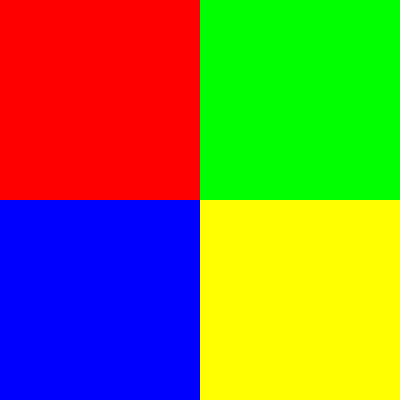
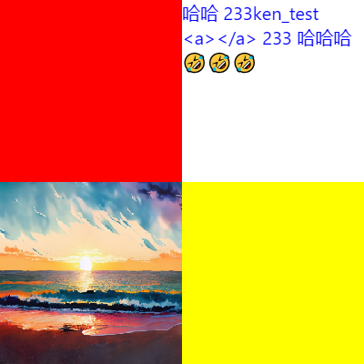

抄[Flutter](https://github.com/flutter/flutter)实现了一个可以直观~~简单快捷~~地构建图片的工具

之前像 [taffy-pvp-card-sw](https://github.com/muedsa/taffy-pvp-card-sw) 这样直接使用Canvas的方式，会让后期维护和修改变的十分困难,
所以急需一个可以结构化构建图像的工具

### Sample: Container
```kotlin
File("sample_container.png").writeBytes(
    SnapshotPNG {
        Container(
            width = 200f,
            height = 200f,
            color = Color.RED
        )
    }
)
```


### Sample: Layout

```kotlin
File("sample_layout.png").writeBytes(
    SnapshotPNG {
        Column {
            Row {
                Container(
                    width = 200f,
                    height = 200f,
                    color = Color.RED
                )
                Container(
                    width = 200f,
                    height = 200f,
                    color = Color.GREEN
                )
            }
            Row {
                Container(
                    width = 200f,
                    height = 200f,
                    color = Color.BLUE
                )
                Container(
                    width = 200f,
                    height = 200f,
                    color = Color.YELLOW
                )
            }
        }
    }
)
```



### Sample: Image & Text

```kotlin
File("sample_image_and_text.png").writeBytes(
    SnapshotPNG {
        Stack {
            CachedNetworkImage("https://picsum.photos/500")
            SimpleText("Hello World!", color = Color.RED, fontSize = 40f)
        }
    }
)
```


### Sample: Parse DOM-LIKE TEXT

```kotlin
val text = """
<Snapshot background="#FFFFFFFF" format="png">
    <Column>
        <Row>
            <Container color="#FF0000" width="200" height="200"/>
            <Container color="#FFFFFF" width="200" height="200">
                <Text color="#0000FF" fontSize="20">哈哈 233<![CDATA[ken_test <a></a> 233 哈哈]]>哈🤣🤣🤣</Text>
            </Container>
        </Row>
        <Row>
            <Image width="200" height="200" url="https://picsum.photos/id/201/200"/>
            <Container color="#FFFF00" width="200" height="200"/>
        </Row>
    </Column>
</Snapshot>
""".trimIndent()
File("sample_parse_dom_like.png").writeBytes(Parser().parse(StringReader(text)).snapshot())
```

