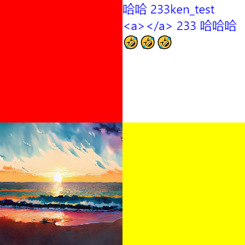
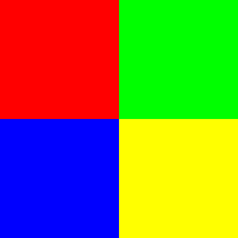

抄[Flutter](https://github.com/flutter/flutter)实现了一个可以直观~~简单快捷~~地构建图片的工具

之前像 [taffy-pvp-card-sw](https://github.com/muedsa/taffy-pvp-card-sw) 这样直接使用Canvas的方式，会让后期维护和修改变的十分困难,
所以急需一个可以结构化构建图像的工具

**Demo**: https://snapshot.muedsa.com

<details>
 <summary><code>POST</code> <code>/snapshot</code> 生成图片</summary>

##### Parameters

dom like text as row request body, example:
```html
<Snapshot background="#FFFFFFFF" type="png">
    <Column>
        <Row>
            <Container color="#FF0000" width="200" height="200" />
            <Container color="#FFFFFF" width="200" height="200">
                <Text color="#0000FF" fontSize="20">哈哈 233<![CDATA[ken_test <a></a> 233 哈哈]]>哈🤣🤣🤣
                </Text>
            </Container>
        </Row>
        <Row>
            <Image width="200" height="200" url="https://samples-files.com/samples/images/png/480-360-sample.png"
                fit="COVER" />
            <Container color="#FFFF00" width="200" height="200" />
        </Row>
    </Column>
</Snapshot>
```

##### Responses

Image ByteArray data, reponse header `Content-Type`: `image/png`, `image/jpeg`, `image/webp`

Example:



</details>


### Sample: Container
```kotlin
File("sample_container.png").writeBytes(
    SnapshotPNG {
        Container(
            width = 200f,
            height = 200f,
            color = Color.RED
        )
    }
)
```


### Sample: Layout

```kotlin
File("sample_layout.png").writeBytes(
    SnapshotPNG {
        Column {
            Row {
                Container(
                    width = 200f,
                    height = 200f,
                    color = Color.RED
                )
                Container(
                    width = 200f,
                    height = 200f,
                    color = Color.GREEN
                )
            }
            Row {
                Container(
                    width = 200f,
                    height = 200f,
                    color = Color.BLUE
                )
                Container(
                    width = 200f,
                    height = 200f,
                    color = Color.YELLOW
                )
            }
        }
    }
)
```



### Sample: Image & Text

```kotlin
File("sample_image_and_text.png").writeBytes(
    SnapshotPNG {
        Stack {
            CachedNetworkImage(
                url = "https://samples-files.com/samples/images/jpg/1280-720-sample.jpg",
                width = 400f,
                height = 400f,
            )
            RichText {
                TextSpan(
                    text = "Hello",
                    style = TextStyle(
                        color = Color.RED,
                        fontSize = 40f
                    )
                )
                TextSpan(
                    text = " World",
                    style = TextStyle(
                        color = Color.GREEN,
                        fontSize = 30f
                    )
                )
            }
        }
    }
)
```


### Sample: Parse DOM-LIKE TEXT

```kotlin
val text = """
<Snapshot background="#FFFFFFFF" type="png">
    <Column>
        <Row>
            <Container color="#FF0000" width="200" height="200"/>
            <Container color="#FFFFFF" width="200" height="200">
                <Text color="#0000FF" fontSize="20">哈哈 233<![CDATA[ken_test <a></a> 233 哈哈]]>哈🤣🤣🤣</Text>
            </Container>
        </Row>
        <Row>
            <Image width="200" height="200" url="https://samples-files.com/samples/images/jpg/480-360-sample.jpg"/>
            <Container color="#FFFF00" width="200" height="200"/>
        </Row>
    </Column>
</Snapshot>
""".trimIndent()
File("sample_parse_dom_like.png").writeBytes(Parser().parse(StringReader(text)).snapshot())
```


> 上述样例图由 `Sample` / `ParserSample` 测试生成。它们是样例再生成器,已加 `@Tag("sample")` 并从默认测试排除(避免默认 `./gradlew test` 联网下载图片或改写仓库文件)。手动再生成:`./gradlew :core:test -PincludeSamples` 与 `./gradlew :parser:test -PincludeSamples`。
> 注:`-PincludeSamples` 只运行 `Sample`/`ParserSample` 样例类,不执行完整测试套件。
