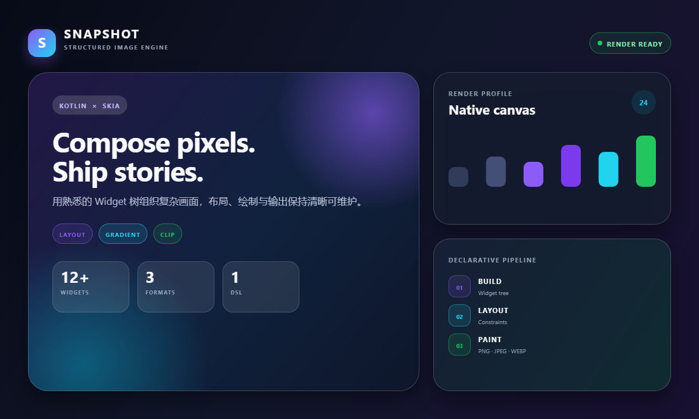
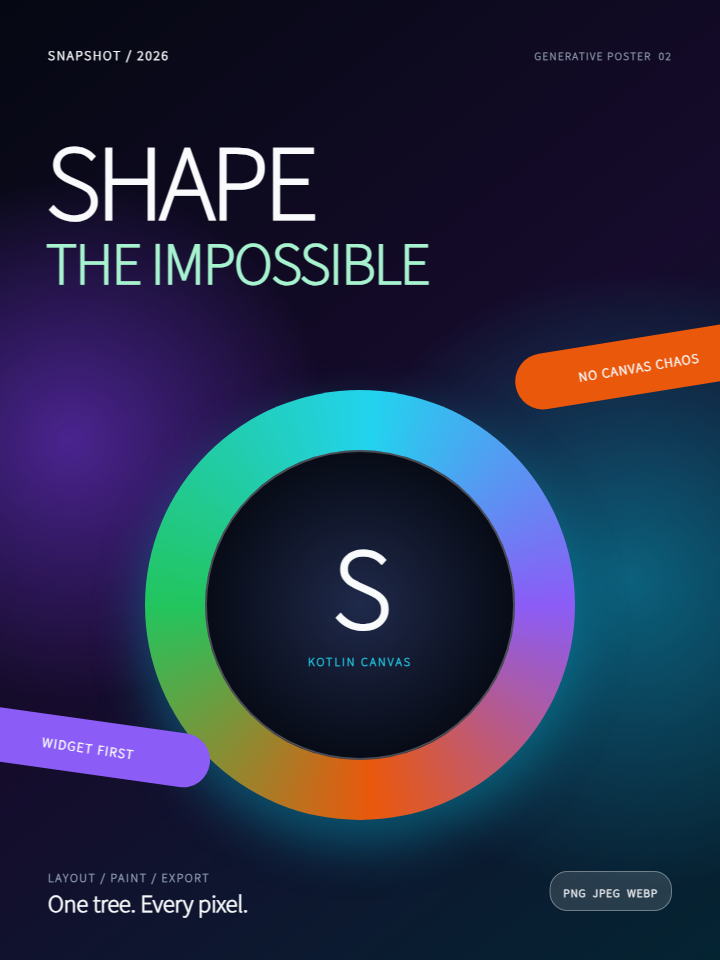
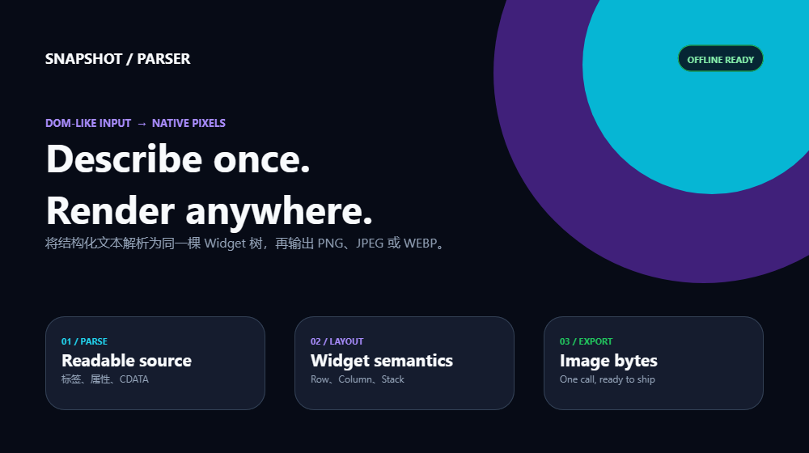

抄[Flutter](https://github.com/flutter/flutter)实现了一个可以直观~~简单快捷~~地构建图片的工具

**Docs**: https://snapshot.muedsa.com

> 品牌图由项目自身的 [`LogoCreator`](core/src/test/kotlin/com/muedsa/snapshot/LogoCreator.kt) 离线渲染生成，包含
> [`logo_mark.png`](logo_mark.png) 图案版、[`logo_mark_mono.png`](logo_mark_mono.png) 单色精简版和
> `logo.png` 项目名称横版。重新生成：`./gradlew :core:test -PincludeSamples --tests 'com.muedsa.snapshot.LogoCreator'`


## 项目特色展示

这些展示图全部由项目自身离线渲染生成，没有使用外部图片素材。完整生成代码见
[`ShowcaseSample.kt`](core/src/test/kotlin/com/muedsa/snapshot/ShowcaseSample.kt) 与
[`ParserShowcaseSample.kt`](parser/src/test/kotlin/com/muedsa/snapshot/ParserShowcaseSample.kt)。

只重新生成这三张离线展示图：

```bash
./gradlew :core:test -PincludeSamples --tests 'com.muedsa.snapshot.ShowcaseSample'
./gradlew :parser:test -PincludeSamples --tests 'com.muedsa.snapshot.ParserShowcaseSample'
```

### 结构化 Bento 仪表盘

使用 `Container`、`Row`、`Column`、`Stack` 和 `Positioned` 组合复杂布局，同时展示渐变、圆角、阴影、裁剪以及内置字体。



### 霓虹视觉海报

通过线性、径向和扫描渐变叠加几何图形，再结合透明度、旋转变换与精细排版生成完整海报。



### 类 DOM 数据卡片

同一套渲染能力也可以由类 DOM 文本驱动：解析标签和属性后构建 Widget 树，最终直接输出图片字节。



> 📖 **文档导航**
> - [使用说明](docs/usage/README.md)：环境与构建、快速上手、Widget 参考、布局/绘制/文本、类 DOM 解析器全部标签与属性、错误处理、FAQ
> - [测试手册](docs/testing/README.md)：testkit、四层断言、golden 三态

<details>
 <summary><code>POST</code> <code>/snapshot</code> 生成图片</summary>

##### Parameters

dom like text as row request body, example:
```html
<Snapshot background="#FFFFFFFF" type="png">
    <Column>
        <Row>
            <Container color="#FF0000" width="200" height="200" />
            <Container color="#FFFFFF" width="200" height="200">
                <Text color="#0000FF" fontSize="20">哈哈 233<![CDATA[ken_test <a></a> 233 哈哈]]>哈🤣🤣🤣
                </Text>
            </Container>
        </Row>
        <Row>
            <Image width="200" height="200" url="https://samples-files.com/samples/images/png/480-360-sample.png"
                fit="COVER" />
            <Container color="#FFFF00" width="200" height="200" />
        </Row>
    </Column>
</Snapshot>
```

##### Responses

Image ByteArray data, reponse header `Content-Type`: `image/png`, `image/jpeg`, `image/webp`

Example:


</details>


### Sample: Container
```kotlin
File("sample_container.png").writeBytes(
    SnapshotPNG {
        Container(
            width = 200f,
            height = 200f,
            color = Color.RED
        )
    }
)
```


### Sample: Layout

```kotlin
File("sample_layout.png").writeBytes(
    SnapshotPNG {
        Column {
            Row {
                Container(
                    width = 200f,
                    height = 200f,
                    color = Color.RED
                )
                Container(
                    width = 200f,
                    height = 200f,
                    color = Color.GREEN
                )
            }
            Row {
                Container(
                    width = 200f,
                    height = 200f,
                    color = Color.BLUE
                )
                Container(
                    width = 200f,
                    height = 200f,
                    color = Color.YELLOW
                )
            }
        }
    }
)
```


### Sample: Image & Text

```kotlin
File("sample_image_and_text.png").writeBytes(
    SnapshotPNG {
        Stack {
            CachedNetworkImage(
                url = "https://samples-files.com/samples/images/jpg/1280-720-sample.jpg",
                width = 400f,
                height = 400f,
            )
            RichText {
                TextSpan(
                    text = "Hello",
                    style = TextStyle(
                        color = Color.RED,
                        fontSize = 40f
                    )
                )
                TextSpan(
                    text = " World",
                    style = TextStyle(
                        color = Color.GREEN,
                        fontSize = 30f
                    )
                )
            }
        }
    }
)
```


### Sample: Parse DOM-LIKE TEXT

```kotlin
val text = """
<Snapshot background="#FFFFFFFF" type="png">
    <Column>
        <Row>
            <Container color="#FF0000" width="200" height="200"/>
            <Container color="#FFFFFF" width="200" height="200">
                <Text color="#0000FF" fontSize="20">哈哈 233<![CDATA[ken_test <a></a> 233 哈哈]]>哈🤣🤣🤣</Text>
            </Container>
        </Row>
        <Row>
            <Image width="200" height="200" url="https://samples-files.com/samples/images/jpg/480-360-sample.jpg"/>
            <Container color="#FFFF00" width="200" height="200"/>
        </Row>
    </Column>
</Snapshot>
""".trimIndent()
File("sample_parse_dom_like.png").writeBytes(Parser().parse(StringReader(text)).snapshot())
```


`<Image>` 与 `<Emoji>` 也支持不联网的内嵌图片：使用 `dataUri="data:image/png;base64,..."` 代替 `url`，两者不能同时指定。默认解码器支持 PNG、JPEG、WebP；应用可通过 `Parser(dataUriImageDecoder = ...)` 提供自己的实现，详见[使用说明](docs/usage/README.md#image)。

> 上述样例图由被 `@Tag("sample")` 标注的样例/配图再生成测试（`Sample`、`LogoCreator`、`ShowcaseSample`、`ParserSample`、`ParserShowcaseSample`）生成，已从默认测试排除，避免默认 `./gradlew test` 改写仓库根文件。三张特色展示图完全离线生成；旧的图片与文本示例仍只在显式再生成时访问外网。手动再生成：`./gradlew :core:test -PincludeSamples` 与 `./gradlew :parser:test -PincludeSamples`。`-PincludeSamples` 只运行这些被标注的类，不执行完整测试套件。
>
> 依赖外网的测试(网络图片缓存、`CachedNetworkImage`、使用 URL 来源的 `ImageEmojiSpan`/`<Emoji>` 等用例)统一标注 `@Tag("network")`,同样从默认 `./gradlew test` 排除;手动运行:`./gradlew :core:test -PincludeNetwork` 与 `./gradlew :parser:test -PincludeNetwork`(语义与 `-PincludeSamples` 相同:只跑该标签)。
